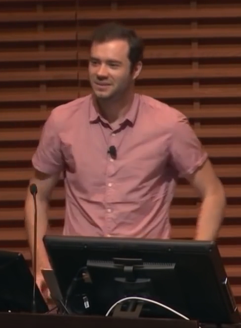
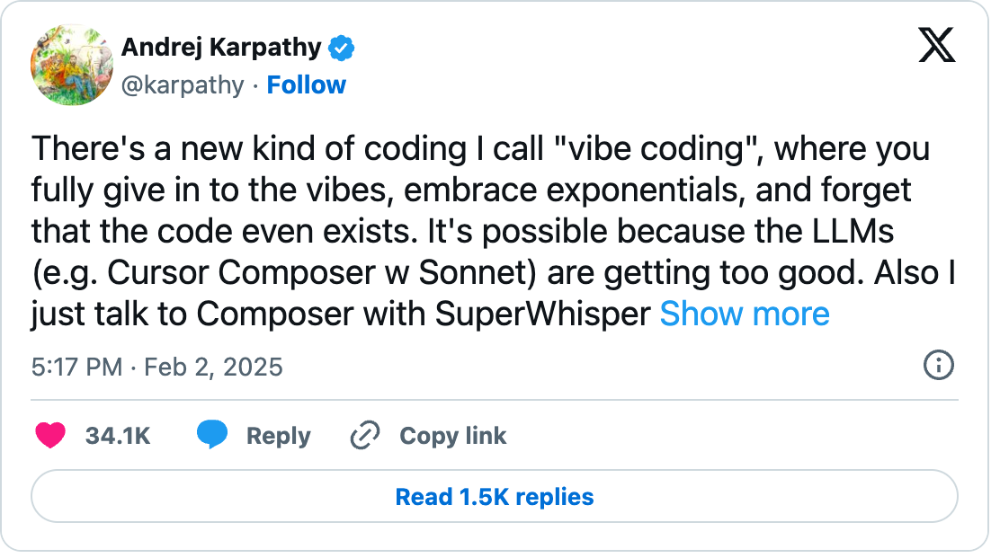

## ¿Quién es Andrej Karpathy?

<!--
GUION DE 50 MINUTOS
  Bloque 1a Karpathy -> el tuit -> definición ..... 3 min  (diap. 2-4, justo tras el título)
  Bloque 0  Apertura: pregunta gancho ............. 3 min  (diap. 5-6)
  Bloque 1b Espectro -> vibe vs ingeniería ........ 2 min  (diap. 7-9)
  Bloque 2  Por qué programar sigue importando ... 10 min  (diap. 8-14)
  Bloque 3  Demo 1: EDA de un EPW ................. 8 min  (diap. 15-18)
  Bloque 4  Demo 2: app Shiny de capitales ........ 8 min  (diap. 19-22)
  Bloque 5  Reproducibilidad ..................... 10 min  (diap. 23-28)
  Bloque 6  Cierre ................................ 4 min  (diap. 29-30)
  Colchón ....................................... 2 min

Marcadores pendientes:
  VIDEO       -> sustituir por  y por  en la gemela
  CAPTURA     -> imagen en img/
  QR          -> generar cuando exista la URL definitiva
  TODO        -> dato por confirmar
-->

::: {.columns}
::: {.column width="35%"}
{height="400px"}

::: {.tiny}
Foto: Gladwin Analytics, 2019, vía Wikimedia Commons, CC BY 3.0.
:::
:::
::: {.column width="65%"}
- Doctorado en Stanford (2015) con [Fei-Fei Li](https://en.wikipedia.org/wiki/Fei-Fei_Li); creó y dio el curso **CS231n** de redes convolucionales.
- Miembro fundador de **OpenAI** (2015-2017); director de IA en **Tesla** (2017-2022), a cargo de la visión del Autopilot; de vuelta en OpenAI (2023-2024).
- En 2017 escribió "Software 2.0": las redes neuronales como nueva forma de programar.
- Educador: la serie **"Neural Networks: Zero to Hero"** y **Eureka Labs** (2024).
- El 2 de febrero de 2025 publicó el tuit que acuñó **vibe coding**.
:::
:::

::: {.notes}
El punto: no es un influencer ni un vendedor de herramientas. Es alguien que construyó
sistemas de producción y enseña desde los fundamentos. Por eso su definición pesa,
y por eso importa que él mismo la acotó a proyectos desechables.
:::

## Febrero de 2025: el tuit

::: {.columns}
::: {.column width="55%"}
[{width="100%"}](https://x.com/karpathy/status/1886192184808149383)

::: {.tiny}
Captura del embed oficial de X, @karpathy, 2 de febrero de 2025. El embed recorta el texto; la publicación completa sigue en el enlace.
:::
:::
::: {.column width="45%"}
- "There's a new kind of coding I call **vibe coding**, where you fully give in to the vibes, embrace exponentials, and forget that the code even exists."
- "I 'Accept All' always, I don't read the diffs anymore."
- Pensado para **proyectos desechables** de fin de semana.
:::
:::

::: {.notes}
Leer las dos citas en voz alta. Subrayar "desechables": el propio Karpathy lo acotó desde el principio.
:::

## ¿Qué es, entonces, el vibe coding?

::: {.pregunta .small}
Describir en lenguaje natural lo que quieres, aceptar lo que el modelo escribe 
**sin leerlo**, y corregir por prueba y error hasta que "funciona".
:::

::: {.notes}
Definición operativa. Dejar la frase en pantalla unos segundos antes de pasar a la pregunta gancho.
:::

## ¿Qué anda haciendo la comunidad?

::: {.columns .small}
::: {.column width="33%"}
### Juguetes que explotaron
- [**MenuGen**](https://karpathy.bearblog.dev/vibe-coding-menugen/) (Karpathy): foto del menú → imágenes de los platillos. Su propio ejemplo de "fin de semana"; lo difícil no fue el código sino "armar el mueble de IKEA" de servicios.
- [**fly.pieter.com**](https://levels.io/fly-pieter-com-vibecoded-flight-simulator) (Pieter Levels): simulador de vuelo MMO en el navegador, prototipo en 3 h con Cursor, Claude y Grok. 1 M USD ARR en 17 días; un año después, 70-90 K USD al mes.
- [**ScubaDuck**](https://blog.ezyang.com/2025/06/vibe-coding-case-study-scubaduck/): un ingeniero de PyTorch se hizo su explorador de datos y documentó el proceso.
:::
::: {.column width="33%"}
### Apps sin programadores
- [**Lovable**](https://techcrunch.com/2026/09/24/lovables-annualized-revenue-crosses-600m-as-vibe-coding-takes-off/): 600 M USD ARR (sep 2026), 100 000 proyectos nuevos al día, 60 % de usuarios no programan. Junto con [Bolt](https://bolt.new), [v0](https://v0.dev) y [Replit](https://replit.com).
- [Un gerente de marketing inmobiliario](https://www.superblocks.com/customers/matthews) que se hizo su generador de *offering memorandums*: de 3-5 días a minutos.
- Lo cotidiano: contador de carbohidratos, sorteo del *standup*, landing pages ([ejemplos](https://www.fuzen.io/posts/vibe-coding-examples-2026)).
:::
::: {.column width="33%"}
### Ciencia
- [Encuesta de Anthropic](https://www.anthropic.com/research/coding-agents-social-sciences) a 1 260 científicos sociales (feb-mar 2026): 81 % ha usado chatbots en su investigación, **20 %** ya usa agentes de código.
- [Claude Code](https://www.scientificamerican.com/article/how-claude-code-is-bringing-vibe-coding-to-everyone/) y Codex como "asistente de laboratorio": análisis, figuras, limpieza de datos.
- Y en casa: [**Protección solar**](https://ener-habitat.github.io/proteccion-solar/) (Ener-Habitat, IER-UNAM), *webapp* en Shiny para Python **sin servidor** (Shinylive/WebAssembly) desarrollada con vibe coding: carta solar estereográfica y diseño de aleros, con pruebas validadas contra pvlib.
:::
:::

::: {.fuente}
Cifras de ingresos reportadas por las propias empresas o sus fundadores.
:::

::: {.notes}
Tres tipos de uso: juguetes virales, apps de negocio hechas por no programadores y ciencia.
El punto de aterrizaje es la tercera columna: en ciencia el uso de agentes es aún minoritario (20 %)
y es exactamente donde el criterio de dominio decide si el número sirve. Enlaza con la pregunta gancho.
:::

# Entonces… ¿realizarías el análisis de un artículo científico o de una tesis usando vibe coding? {.center background-color="#1f3a5f"}

<!-- Bloque 0 · 3 min -->

## {.center}

::: {.pregunta}
¿Usaron IA para algo de su trabajo esta semana?
:::

::: {.notes}
Pregunta rápida para calibrar la sala antes de entrar en materia.
:::

## {.center}

::: {.pregunta}
Entonces… ¿realizarías el análisis de un artículo científico o de una tesis usando vibe coding?
:::

 

::: {.pregunta}
**Sí, pero con estas consideraciones:**
:::

## Ocho consideraciones

::: {.cards}
::: {.card}
[1]{.num}

**Maneja el entorno de programas**
:::

::: {.card}
[5]{.num}

**Ejecuta el plan parte por parte**
:::

::: {.card}
[2]{.num}

**Controla el espacio de trabajo y la estructura**
:::

::: {.card}
[6]{.num}

**Revisa TODO lo que la IA escribe**
:::

::: {.card}
[3]{.num}

**Haz un plan inicial de lo que quieres hacer con los datos**
:::

::: {.card}
[7]{.num}

**Pide ideas, retroalimenta, pon a prueba**
:::

::: {.card}
[4]{.num}

**Define herramientas y reglas del espacio de trabajo**
:::

::: {.card}
[8]{.num}

**Recrea y revisa tu prototipo**
:::
:::

::: {.notes}
Cada consideración tiene un clip corto. Este es el índice; los ocho clips que siguen son el corazón de la charla.
:::

## Ejemplo aplicado: el clima de Torreón

::: {.cards .dos}
::: {.card}
[1]{.num}

**Explorar un EPW**

[TMYx de Torreón (climate.onebuilding.org): metadatos, 8760 horas, calidad y meses de origen.]{.desc}
:::

::: {.card}
[2]{.num}

**Caracterizar el clima**

[Temperatura (mensual, percentiles, oscilación), radiación (GHI, DNI, DHI) y viento (velocidad, rosa de vientos, calmas).]{.desc}
:::

::: {.card}
[3]{.num}

**Cuantificar el calor con confort adaptativo**

[ASHRAE 55: $T_{conf} = 0.31\,\bar{T}_{pma} + 17.8$, límite de 80 % en ±3.5 °C. Grados-hora por encima del límite superior.]{.desc}
:::

::: {.card}
[4]{.num}

**Potencial solar mensual en superficie horizontal**

[Suma de GHI por mes en kWh/m²·mes y total anual en kWh/m²·año, contrastado con PVGIS.]{.desc}
:::
:::

::: {.notes}
Este es el caso que recorren los ocho clips. Todo sale de un solo archivo EPW y de pvlib + pandas.
Torreón (Coahuila, ~1 120 m, UTC−6): clima semiárido con veranos calurosos, inviernos frescos y gran oscilación diaria.
Sirve para ver calor y frío en el mismo año con el modelo adaptativo.
:::

## 1. Maneja el entorno de programas

::: {.video-placeholder}
[VIDEO · uv para el caso Torreón (≤ 3 min)]{.video-title}

**Debe demostrar:**

- `uv init --package clima-torreon`, `uv python pin 3.12`, `uv add pvlib pandas matplotlib plotly windrose`.
- La IA propone `pip install pythermalcomfort` sin verificar. El humano revisa en PyPI qué es, quién lo mantiene y si calcula el modelo adaptativo que necesitamos, antes de `uv add`.
- `uv run python -c "import pvlib; print(pvlib.__version__)"` → 0.16.1, fijado en `uv.lock`.
- Cierre: `uv sync --locked` en una carpeta limpia reproduce el entorno exacto.

::: {.meta}
YouTube: `{}` · Local: `videos/c1-uv.mp4`
:::
:::

## 2. Controla el espacio de trabajo y la estructura

::: {.video-placeholder}
[VIDEO · espacio de trabajo (≤ 3 min)]{.video-title}

**Debe demostrar:**

- Carpetas: `data/001_raw/` (EPW inmutable), `data/002_interim/`, `src/clima/`, `analysis/`, `tests/`, `docs/`.
- Descargar el TMYx de Torreón, copiarlo a `data/001_raw/`, calcular `sha256` y escribir `FUENTES.md` (URL, fecha, variante 2007-2021).
- `git init`, `.gitignore` y primer commit antes de escribir código.

::: {.meta}
YouTube: `{}` · Local: `videos/c2-espacio.mp4`
:::
:::

## 3. Haz un plan inicial de lo que quieres hacer con los datos

::: {.video-placeholder}
[VIDEO · plan en Markdown (≤ 3 min)]{.video-title}

**Debe demostrar:**

- Prompt: "Escribe `PLAN.md` para caracterizar el clima de Torreón desde el EPW, cuantificar el calor con confort adaptativo y calcular el potencial solar mensual horizontal. No escribas código."
- La IA propone supuestos erróneos: media predominante con la temperatura **horaria**, GHI en W/m², rosa de vientos con la dirección hacia donde **va** el viento.
- El humano corrige el plan: media diaria móvil de 7 días previos, Wh/m² → kWh/m², dirección de **procedencia**, y qué hacer si $\bar{T}_{pma}$ sale de 10-33.5 °C.
- Commit del plan: es el contrato con el agente.

::: {.meta}
YouTube: `{}` · Local: `videos/c3-plan.mp4`
:::
:::

## 4. Define herramientas y reglas del espacio de trabajo

::: {.video-placeholder}
[VIDEO · reglas para el agente (≤ 3 min)]{.video-title}

**Debe demostrar:**

- `AGENTS.md`: solo `uv`; no modificar `data/001_raw/`; unidades en los nombres (`ghi_wh_m2`, `gh_calor_c_h`); modelo ASHRAE 55 adaptativo con su intervalo de validez; toda función en `src/` lleva prueba.
- `CLAUDE.md` con una línea: "Lee y sigue `AGENTS.md`".
- Prueba en vivo: "limpia el EPW y guárdalo". El agente se niega a sobrescribir `data/001_raw/` y escribe en `data/002_interim/`.
- Contraste: el mismo prompt sin `AGENTS.md` sobrescribe el EPW original.

::: {.meta}
YouTube: `{}` · Local: `videos/c4-reglas.mp4`
:::
:::

## 5. Ejecuta el plan parte por parte

::: {.video-placeholder}
[VIDEO · Quarto y Python, paso a paso (≤ 4 min)]{.video-title}

**Debe demostrar:**

- `analysis/01_clima.qmd`, una sección del plan por vez, `uv run quarto render` tras cada paso.
- Exploración: `read_epw` (la IA inventa `map_variables=True` → `TypeError`), metadatos y meses de origen del TMY.
- Caracterización: temperatura mensual y percentiles, heatmap de GHI, rosa de vientos y porcentaje de calmas.
- Calor y sol: grados-hora sobre el límite adaptativo por mes; barras de GHI mensual en kWh/m²·mes.

::: {.meta}
YouTube: `{}` · Local: `videos/c5-quarto.mp4`
:::
:::

## 6. Revisa TODO lo que la IA escribe

::: {.video-placeholder}
[VIDEO · revisión del código (≤ 3 min)]{.video-title}

**Debe demostrar:**

- `git diff` línea por línea, en voz alta.
- Tres errores que no lanzaron excepción: la media predominante calculada con la temperatura horaria; el límite superior sumado en °C·día en vez de °C·h; la GHI mensual dividida entre el número de horas en vez de sumada.
- Pedir a la IA que explique una línea sospechosa y contrastar con ASHRAE 55 y la documentación de pvlib.
- Commit con qué se aceptó y qué se corrigió; entrada en `docs/bitacora-ia.md`.

::: {.meta}
YouTube: `{}` · Local: `videos/c6-revision.mp4`
:::
:::

## 7. Pide ideas, retroalimenta, pon a prueba

::: {.video-placeholder}
[VIDEO · validación del caso (≤ 4 min)]{.video-title}

**Debe demostrar:**

- "Propón pruebas." La IA escribe una tautológica. El humano pide pruebas físicas: 8760 filas, GHI ≥ 0 y cero de noche, velocidad del viento ≥ 0, $T_{conf}$ solo con $10 \le \bar{T}_{pma} \le 33.5$ °C.
- `uv run pytest -q`: una prueba **falla** porque los primeros días de enero no tienen días previos para la media predominante. Como el TMY es cíclico, se usan los últimos días de diciembre, y se documenta la decisión.
- Pedir ideas: "¿qué otra métrica de calor usarías?". La IA sugiere horas sobre 35 °C; el humano la acepta como complemento, no como sustituto.

::: {.meta}
YouTube: `{}` · Local: `videos/c7-validacion.mp4`
:::
:::

## 8. Tuviste tu primer prototipo: ahora recrea y revisa

::: {.video-placeholder}
[VIDEO · human in the loop (≤ 4 min)]{.video-title}

**Debe demostrar:**

- **Recrear desde cero:** clonar en una carpeta limpia y correr `uv sync --locked && uv run quarto render`. El reporte sale idéntico o el prototipo no está terminado.
- **Recorrer el código:** explicar en voz alta el cálculo de $\bar{T}_{pma}$ y de los grados-hora; reescribir uno a mano y comprobar que da lo mismo.
- **Referencia externa:** GHI mensual del EPW contra PVGIS-ERA5 o NASA POWER para Torreón, con la fuente citada.
- **Cerrar el ciclo:** anotar en la bitácora qué se recreó, qué se entendió y qué se cambió. El humano firma; la IA no.

::: {.meta}
YouTube: `{}` · Local: `videos/c8-recrea.mp4`
:::
:::

::: {.notes}
Las pruebas físicas detectan lo imposible; la referencia externa detecta lo plausible pero incorrecto.
:::

# Cierre {.center background-color="#1f3a5f"}

## Entonces… ¿realizarías el análisis de una tesis con vibe coding?

::: {.pregunta}
**Sí**, si el resultado viene con
:::

 

::: {.cards .tres}
::: {.card}
[A]{.num}

**Entorno y datos bajo control**

[Pasos 1, 2 y 4: `uv.lock`, datos crudos intocables, reglas escritas.]{.desc}
:::

::: {.card}
[B]{.num}

**Un plan que tú revisaste**

[Pasos 3 y 5: el plan es el contrato; se ejecuta por partes.]{.desc}
:::

::: {.card}
[C]{.num}

**Una persona que revisó, probó y recreó**

[Pasos 6, 7 y 8: diff, pruebas físicas, reproducción desde cero.]{.desc}
:::
:::

::: {.notes}
Cierra la pregunta del separador. La IA sube el piso; el techo, criterio de dominio, verificación y firma, sigue siendo humano.
Si alguien pregunta por evidencia: el ensayo de Anthropic (Shen y Tamkin 2026) encontró 50 % contra 67 % de comprensión, con la brecha mayor en depuración;
y solo 68.3 % de los proyectos generados por agentes corren sin tocar nada (Vangala et al. 2026).
:::

## Para seguir

::: {.columns .small}
::: {.column width="50%"}
**Repositorio del ejemplo de Torreón**\
QR: `github.com/TODO/clima-torreon`

**Los ocho videos**\
QR: lista de reproducción de YouTube (TODO)

**Estas diapositivas**\
QR: GitHub Pages (TODO)
:::
::: {.column width="50%"}
**Lecturas**

- Shen y Tamkin 2026, "How AI Impacts Skill Formation", arXiv:2601.20245
- Vangala et al. 2026, "AI-Generated Code Is Not Reproducible (Yet)", arXiv:2512.22387
- Bridgeford, Poldrack et al. 2025, "Ten Simple Rules for AI-Assisted Coding in Science"
- Documentación de [pvlib](https://pvlib-python.readthedocs.io), [uv](https://docs.astral.sh/uv/) y [Quarto](https://quarto.org)
:::
:::

## {.center}

::: {.pregunta}
¿Qué parte de tu próximo análisis **no** delegarías, y por qué?
:::

 

::: {.small style="text-align: center;"}
Guillermo Barrios del Valle · gbv@ier.unam.mx · Instituto de Energías Renovables, UNAM
:::

::: {.notes}
Dejar la pregunta en pantalla durante las preguntas del público.
:::
